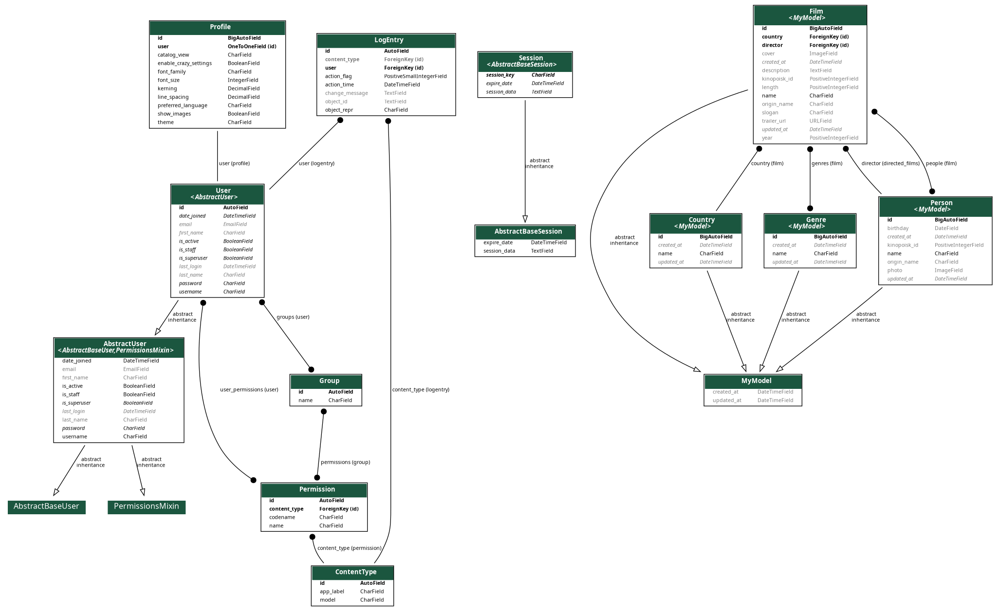

# Постановка задачи

Необходимо реализовать дополнительный функционал в рамках [эталонного проекта](https://devel.mephi.ru/aialeksandrov/filmbase2024) «Каталог фильмов».
**Задание №7.6** Реализовать возможность персональной настройки отображения содержимого сайта.

## Проектирование моделей

## Запуск проекта

~~~cmd
python -m pip install -r requirements.txt
python manage.py migrate
python manage.py import_films
python manage.py runserver
~~~

## Для построения диаграммы классов:

~~~cmd
python manage.py graph_models -a --dot -o myapp_models.dot
dot -Tpng myapp_models.dot -omyapp_models.png
~~~